<picture>
  <source media="(prefers-color-scheme: dark)" srcset="assets/scenery-dark.svg">
  
</picture>

  <code><a href="https://anzalabidi.dev">anzalabidi.dev</a></code> &nbsp;
  <code><a href="https://anzal.hashnode.dev/">writing</a></code> &nbsp;
  <code><a href="https://www.linkedin.com/in/anzal-husain-abidi-740a40204/">linkedin</a></code> &nbsp;
  <code><a href="https://x.com/AnzalAbidi">x</a></code> &nbsp;
  <code><a href="mailto:anzalabidi@gmail.com">email</a></code>

<picture>
  <source media="(prefers-color-scheme: dark)" srcset="assets/card-dark.svg">
  
</picture>

<picture>
  <source media="(prefers-color-scheme: dark)" srcset="assets/journey-dark.svg">
  
</picture>

<picture>
  <source media="(prefers-color-scheme: dark)" srcset="assets/skyline-dark.svg">
  
</picture>

<picture>
  <source media="(prefers-color-scheme: dark)" srcset="assets/live-dark.svg">
  
</picture>

## Open source

| Project | | What it is |
| :-- | --: | :-- |
| **[quicky-wiki](https://github.com/anzal1/quicky-wiki)** | ★ 23 | LLM knowledge compiler. Documents in, a confidence-scored knowledge graph out. Built from Karpathy's "LLM Wiki" idea. |
| **[ai-system-design](https://github.com/anzal1/ai-system-design)** | ★ 8 | Handbook for production AI systems: RAG, agents, evals, observability, cost, and the trade-offs between them. |
| **[agentreplay](https://github.com/anzal1/agentreplay)** | ★ 3 | Failed agent runs become regression tests, with traces, side-effect diffs and release gates. Node, Python, Go. |
| **[unclaude](https://github.com/anzal1/unclaude)** | ★ 3 | Autonomous AI agent with multi-provider routing, memory consolidation and a 24/7 daemon. |
| **[pact](https://github.com/anzal1/pact)** | | Cryptographic identity for AI agents, with Ed25519 delegation chains and narrowing-only capabilities. |
| **[Medusa AI](https://github.com/anzal1/Sih-2023-Frontend)** | 🏆 | Browser-first exam proctoring without surveillance theatre. **SIH 2023 national winner.** |

## Toolkit

**Languages**

    

**AI & agents**, the providers I've shipped on

       

**Voice & realtime**

  

**Frontend**

    

**Backend & data**

    

**Infra & observability**

    

## Experience

| Period | Company | Role |
| :-- | :-- | :-- |
| Aug 2026 – Present | **Global University Systems** | Lead Forward Deployed Engineer |
| Nov 2025 – Aug 2026 | **Kenverse** | Senior Software Engineer, Team Lead |
| Jun 2024 – Oct 2025 | **Zomato** | Software Development Engineer |
| Feb 2023 – Jun 2024 | **BeA Brand** | Software Development Intern |
| Nov 2021 – Feb 2023 | **DevDynamics** | Software Development Intern |

<b>The detail</b>

 

**Global University Systems** · Lead Forward Deployed Engineer · UK, remote
- Leading forward deployed engineering in the Chief AI Officer's team, building the AI platform for a group of 30+ universities and business schools
- Multi-tenant AI gateway and a shared model client that every LLM call in the group passes through, with auth, rate limiting, budgets, data residency, redaction and guardrails
- One-click, on-brand generative AI copy inside Salesforce for the group's marketing teams
- Call-quality and advisor-performance analytics for admissions teams

**Kenverse** · Senior Software Engineer, Team Lead · Delhi, remote
- Led a 14-person team of engineers and interns building Kai, a multi-tenant voice and chat AI platform, from experiments into live customer deployments
- Real-time voice and chat flows: retrieval, tool calls, multilingual behaviour, latency, fallbacks, noisy phone audio
- Lead-funnel integrations with validation, callbacks, retries, idempotency, and operational visibility

**Zomato** · Software Development Engineer · Gurugram
- Led end-to-end development for the Feeding India initiative; 50% reduction in build times
- Built and productionized a centralized rendering engine for high-traffic internal tools, with load shedding, stateless request processing, S3 caching
- Contributed to Espresso, a high-performance PDF library used across Zomato, and a React Native facial-recognition attendance system

**BeA Brand** · Software Development Intern · Noida, remote
- Built the MVP from scratch and led the frontend team shipping its first features; admin portal, design system, CI/CD

**DevDynamics** · Software Development Intern · Bengaluru, remote
- Core UI and base components; reusable stat cards with Recharts and GraphQL; frontend re-architecture

## Writing

| Post | |
| :-- | :-- |
| [Your Wiki Doesn't Know What It Doesn't Know](https://anzal.hashnode.dev/your-wiki-doesn-t-know-what-it-doesn-t-know) | Apr 2026 |
| [The Authentication Gap That Every AI Agent Lives In](https://anzal.hashnode.dev/the-authentication-gap-that-every-ai-agent-lives-in) | Feb 2026 |
| [Building Production-Grade Voice AI: The Pain Points Nobody Talks About](https://anzal.hashnode.dev/building-production-grade-voice-ai-the-pain-points-nobody-talks-about) | Feb 2026 |
| [UnClaude: Building an Open-Source AI Engineer with No Model Lock-In](https://anzal.hashnode.dev/unclaude-building-an-open-source-ai-engineer-with-no-model-lock-in) | Jan 2026 |

  <a href="https://anzalabidi.dev"><b>anzalabidi.dev</b></a> ·
  <a href="mailto:anzalabidi@gmail.com">anzalabidi@gmail.com</a> ·
  <a href="https://www.linkedin.com/in/anzal-husain-abidi-740a40204/">LinkedIn</a> ·
  <a href="https://x.com/AnzalAbidi">X</a> ·
  <a href="https://anzal.hashnode.dev/">Hashnode</a>

B.Tech CS, Jamia Millia Islamia · New Delhi · remote

